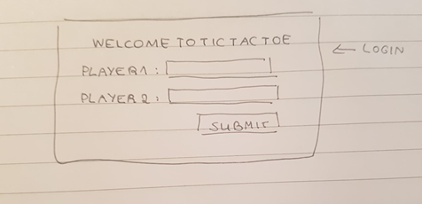
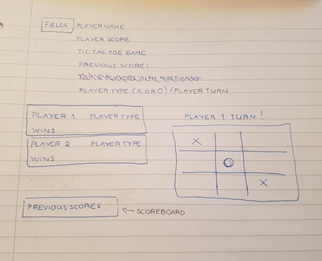
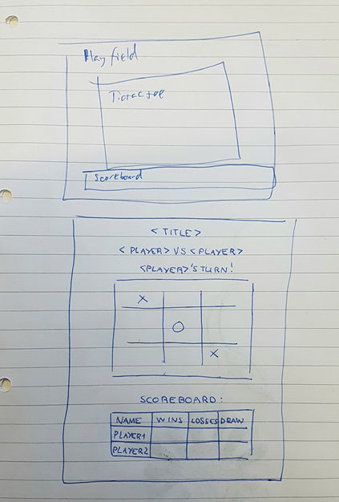
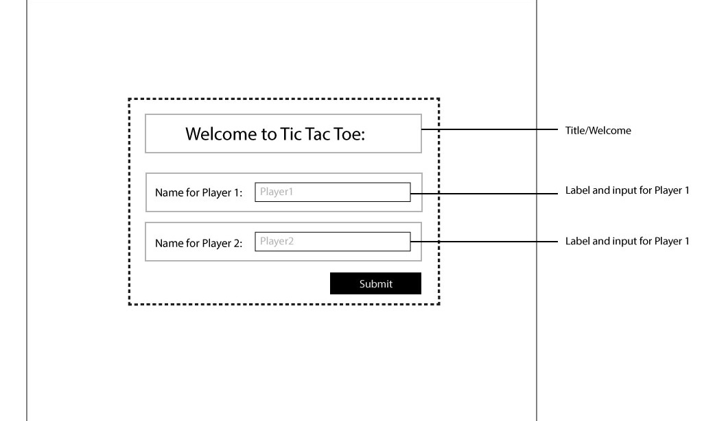
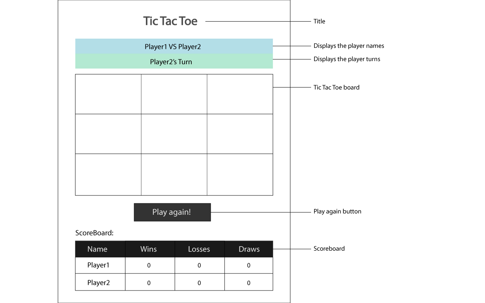
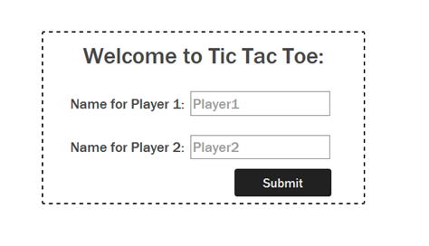
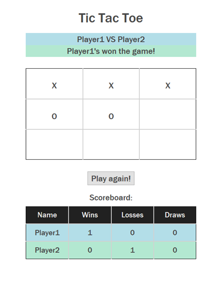

# Design Report

##### Late Term Assignment - Hugbúnaðarfræði 2018
Authors : Sofia Basilio, Rolandas Mineika, Jakob Guðnason, Axel Þórisson, Eyþór Hafliðason 

#### Introduction
This document is the design report for the Late Term Assignment where we design the Tic Tac Toe.
We first started by drawing it out on paper and then passing it onto Adobe Illustrator where the colors and other attributes were picked.
It is also important to mention that for this project we used Bootstrap, a very important kit to make a responsive web page. 
We mostly used the following built-in bootstrap class in our design:
1.	Container – used for centering and keeping the elements in one single organized div;
2.	Col-md – this is used for medium sized pages, col are columns that are divided in 12, 12 being the occupation of the whole div;
3.	Col-sm – used for smaller sized pages.
The rest of the classes that we created will be described in the chapter Style.css.

#### First Prototype

The first prototype is usually drawn in a primitive way, using sticky nots or simply drawn on paper. This was the following result of the first prototype:

Prototype for the assignment of the players:

Prototype revolving on the elements of the Tic Tac Toe interface.

The following image is the prototype for the game itself:

#### Second Prototype

As mentioned in the introduction, the second prototype was drawn in Adobe Illustrator. 
The following prototype is for the login:

The prototype below is for the playfield of Tic Tac Toe:

#### Final Design

This is the product of the programmed web page using the previous designs.

#### Style.css

|    Name                 |    Type         |    Description    |
|-------------------------|----------------------|---------------------------------------------------------------------------------------------------------------------------------------------------|
|    body                 |    HTML tag          |    This tag was used to indicate the general   size, color and family of the font, add some padding at the top and align all   text as center.    |
|    container            |    Boostrap class    |    The container class was fixed to have some   padding and a width.                                                                              |
|    login                |    Class             |    To add some dashed border to the login form.                                                                                                   |
|    inputtext            |    Class             |    Added margin to the input in the login.                                                                                                        |
|    loginbtn             |    Class             |    Styled the button for the login.                                                                                                               |
|    division             |    Class             |    Used to divide the first 3 lines, the   playfield and the score board.                                                                         |
|    title                |    Class             |    Styling the title for the playfield.                                                                                                           |
|    Blue / green         |    Class             |    Coloring the background of the td’s, the   Player vs Player and the Player’s turn.                                                             |
|    h1, table, tr, td    |    HTML tags         |    Used for styling the font and add border.                                                                                                      |
|    scoreboard-table     |    Class             |    Used to style the Scoreboard table, mainly   the font and colors.                                                                              |
|    thead                |    Class             |    Adding background color to the first row of   the scoreboard table.                                                                            |
|    boardPiece           |    Class             |    Used to style each slot in the playfield   table, adding hover effects as well.                                                                |
#### Other Details

- The webpage is fully responsive being able to display it on small, medium and big sized screens.
- The colours are light and good to the eye.
- The HTML was properly divided, every single element has a parent 
.
- A simple form was used for the login, where the login will simply let the players insert their names, player1 being the one that goes first or X, and player 2 the O.
